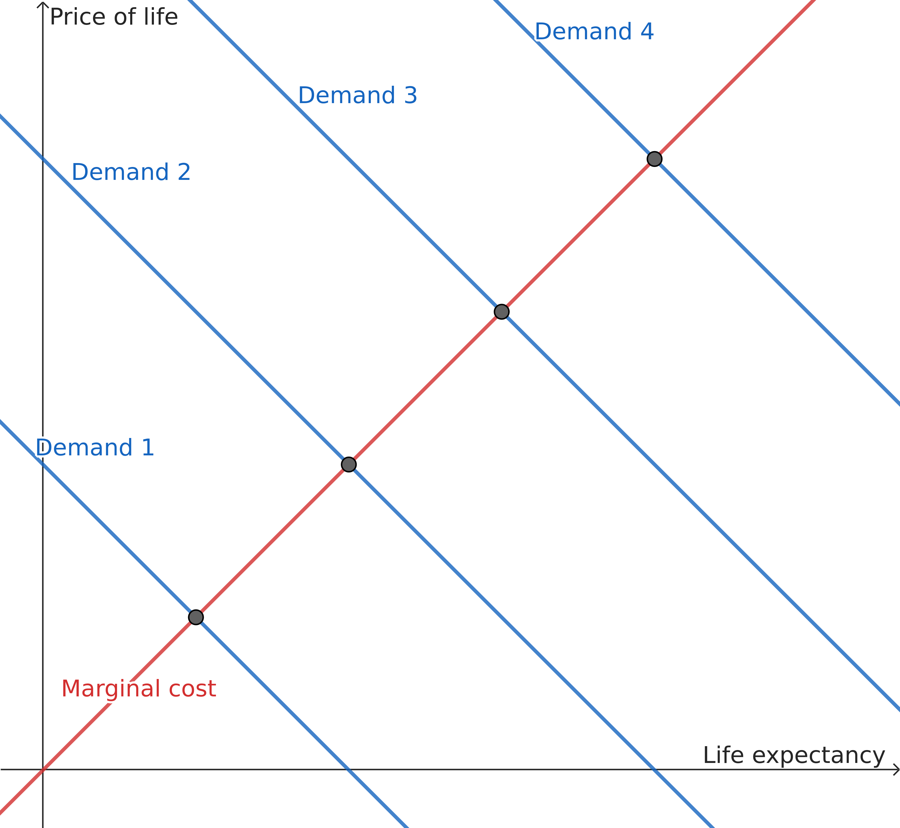

```{r, echo = FALSE}
# needed for lubridate
library(timechange)

library(dplyr, warn.conflicts = FALSE)
library(ggplot2)
library(ivreg)
library(lubridate, warn.conflicts = FALSE)
library(pander)
library(plm, warn.conflicts = FALSE)
library(purrr)
library(readr)
suppressPackageStartupMessages(library(sf))
library(stringi)
library(tidyr)

# dont split tables
panderOptions("table.split.table", Inf)

RECENT_YEAR = 2019
DISPLAY_FIGURES = 3

# Throughout, set na to "", not "NA", when reading csvs
# because "NA" is Namibia's country code.

raw_WDI_data <-
  read_csv("data/WDI_data.csv", show_col_types = FALSE, na = "") %>%
  rename(
    country_code = iso2c,
    world_bank_country = country
  ) %>%
  # don't need this
  select(-iso3c)

raw_map_data <-
  st_read("data/map_data.gpkg", quiet = TRUE) %>%
  select(map_country = name_long, country_code = iso_a2) %>%
  # with no country code, we can't match anyway
  # countries without a code: Northern Cyprus, Kosovo, and Somaliland
  filter(!is.na(country_code))

shortest <- function(string_1, string_2) {
  ifelse(
    is.na(string_1) | is.na(string_2),
    coalesce(string_1, string_2),
    ifelse(
      stri_length(string_1) < stri_length(string_2) &
        # try to avoid country names with commas in them
        !stri_detect_fixed(string_1, ","),
      string_1,
      string_2
    )
  )
}

# all countries from all 3 datasets
# the WDI data includes a "euro area" country which I need currency data for
country_data <-
  read_csv("data/countries.csv", show_col_types = FALSE, na = "") %>%
  select(
    countrycode_country = country.name.en,
    country_code = iso2c
  ) %>%
  # with no country code, we can't match
  filter(!is.na(country_code)) %>%
  # add in world bank countries
  full_join(
    raw_WDI_data %>%
      select(country_code, world_bank_country) %>%
      distinct(),
    by = "country_code"
  ) %>%
  # add in map countries
  full_join(
    tibble(raw_map_data) %>%
    select(country_code, map_country),
    by = "country_code"
  ) %>%
  # use the shortest country name
  mutate(country = shortest(
    world_bank_country,
    shortest(countrycode_country, map_country)
  )) %>%
  select(
    -countrycode_country,
    -world_bank_country,
    -map_country
  )

GDP_deflator_data <-
  read_csv("data/GDP_deflators.csv", na = "", show_col_types = FALSE) %>%
  # average by year
  mutate(year = year(date)) %>%
  group_by(year) %>%
  summarize(GDP_deflator = mean(value))

CPI_data <-
  read_csv("data/CPIs.csv", na = "", show_col_types = FALSE) %>%
  # average by year
  mutate(year = year(date)) %>%
  group_by(year) %>%
  summarize(CPI = mean(value))

recent_CPI <- 
  CPI_data %>%
  filter(year == RECENT_YEAR) %>%
  .$CPI

recent_GDP_deflator <-
  GDP_deflator_data %>%
  filter(year == RECENT_YEAR) %>%
  .$GDP_deflator

all_countries = country_data$country

# sanity checks
if (any(duplicated(all_countries))) {
  stop("Repeated countries")
}

if (any(is.na(all_countries))) {
  stop("Missing countries")
}

if (any(stri_detect_fixed(all_countries, ","))) {
  stop("Missing countries")
}

# replace country names
map_data <-
  raw_map_data %>%
  left_join(
    country_data %>% select(country, country_code),
    by = "country_code"
  ) %>%
  select(-map_country, -country_code)

WDI_variables <-
  read_csv(
    "data/selected_WDI_variables.csv",
    show_col_types = FALSE,
    na = ""
  ) %>%
  left_join(
    read_csv("data/all_WDI_variables.csv", show_col_types = FALSE, na = ""),
    by = "name"
  ) %>%
  rename(
    variable = Variable,
    variable_code = indicator,
    from_organization = sourceOrganization,
    from_database = sourceDatabase
  )

# replace world bank country names with our country names
WDI_data <-
  raw_WDI_data %>%
  # replace country names
  left_join(
    country_data %>% select(country, country_code),
    by = "country_code"
  ) %>%
  select(-country_code, -world_bank_country) %>%
  # replace variable codes
  pivot_longer(
    c(-year, -country),
    names_to = "variable_code",
    values_drop_na = TRUE
  ) %>% 
  left_join(
    WDI_variables %>% select(variable, variable_code),
    by = "variable_code"
  ) %>%
  select(-variable_code) %>%
  pivot_wider(names_from = variable, values_from = value) %>%
  # transformations for the regression
  left_join(CPI_data, by = "year") %>%
  left_join(GDP_deflator_data, by = "year") %>%
  mutate(
    log_population_density = log(population_density),
    log_annual_precipitation = log(annual_precipitation),
    log_annual_precipitation_squared = log_annual_precipitation ^ 2,
    # historical local currency
    # * historical international $ / historical local currency
    international_historical_GDP_per_capita =
      local_historical_GDP_per_capita / PPP_exchange_rate,
    log_GDP_per_capita = log(
      # * output / historical US and international $
      # * US and international $ in 2019 / output
      international_historical_GDP_per_capita / GDP_deflator * recent_GDP_deflator
    ),
    log_CPI_GDP_per_capita = log(
      # * basket / historical US and international $
      # * US and international $ in 2019 / basket
      international_historical_GDP_per_capita / CPI * recent_CPI
    ),
    log_nominal_GDP_per_capita = log(
      # historical local currency
      # * historical US $ / historical local currency
      local_historical_GDP_per_capita / nominal_exchange_rate
      # * output / historical US $
      # * US $ in 2019 / output
      / GDP_deflator * recent_GDP_deflator
    )
  )

country_replacements <- read_csv(
  "data/country_replacements.csv",
  show_col_types = FALSE,
  na = ""
)

currency_country_replacements <- read_csv(
  "data/currency_country_replacements.csv",
  show_col_types = FALSE,
  na = ""
)

only_positive = function(variable) {
  ifelse(variable <= 0, NA, variable)
}

ratios <-
  # read in the data from each country and bind together
  list.files("data/ratios", full.names = TRUE) %>%
  map_dfr(
    function(file) {
      read_csv(
        file,
        na = c("", "Not Stated", "Unknown/Not Stated"),
        # read in everything as character; parse later
        col_types = cols(.default = col_character())
      )
    }
  ) %>%
  select(
    tufts_currency_country = `Currency Country:`,
    RECENT_YEAR = `Currency Year:`,
    local_historical_price_of_life =
      `Incremental Cost-Effectiveness Ratio (Original currency and year):`,
    ratio_index = index,
    year = `Publication Year`,
    currency_year = `Currency Year:`,
    tufts_country = `Study Country:`,
    gender = `Target Genders:`
  ) %>%
  mutate(
    # basic data cleaning
    local_historical_price_of_life = as.numeric(local_historical_price_of_life),
    # 0 means NA
    year = as.numeric(year) %>% ifelse(. == 0, NA, .),
    currency_year = as.numeric(currency_year),
    RECENT_YEAR = as.numeric(RECENT_YEAR),
    gender = ifelse(
      # these mean the same thing
      gender == "Male, Female" | gender == "Female, Male",
      "All",
      gender
    ),
    # split figures in international dollars into a seperate column
    is_international = tufts_currency_country == "International",
    local_historical_price_of_life = 
      ifelse(is_international, NA, local_historical_price_of_life),
    already_international_price_of_life = 
      ifelse(is_international, local_historical_price_of_life, NA),
    # international isn't a country so remove it
    tufts_currency_country =
      ifelse(is_international, NA, tufts_currency_country)
  ) %>%
  # replace country aliases
  left_join(country_replacements, by = "tufts_country") %>%
  mutate(country = coalesce(country_replacement, tufts_country)) %>%
  # replace currency country aliases
  left_join(currency_country_replacements, by = "tufts_currency_country") %>%
  mutate(currency_country = coalesce(
    currency_country_replacement,
    tufts_currency_country
  )) %>%
  # add in CPIs
  left_join(
    CPI_data %>% select(currency_year = year, CPI),
    by = "currency_year"
  ) %>%
  left_join(
    GDP_deflator_data %>% select(currency_year = year, GDP_deflator),
    by = "currency_year"
  ) %>%
  # add in exchange rates
  left_join(
    WDI_data %>%
      select(
        currency_year = year,
        currency_country = country,
        PPP_exchange_rate,
        nominal_exchange_rate
      ),
    by = c("currency_year", "currency_country")
  ) %>%
  mutate(
    # make sure not to paste in NA
    country_year = ifelse(
      is.na(country) | is.na(year),
      NA,
      paste0(country, " ", year)
    ),
    international_historical_price_of_life = coalesce(
      # already have international dollars for some countries
      already_international_price_of_life,
      # historical local currency
      # * historical international $ / historical local currency
      local_historical_price_of_life / PPP_exchange_rate
    ),
    # ignore negative or 0 values, which I can't log
    log_price_of_life = log(only_positive(
      international_historical_price_of_life
      # * basket / historical international $
      # * international $ in 2019 / basket
      / GDP_deflator * recent_GDP_deflator
    )),
    # ignore negative or 0 values, which I can't log
    log_nominal_price_of_life = log(only_positive(
      # historical local currency
      # * historical US $ / historical local currency
      local_historical_price_of_life / nominal_exchange_rate
      # * output / historical US $
      # * US $ in 2019 / output
      / GDP_deflator * recent_GDP_deflator
    )),
    # ignore negative or 0 values, which I can't log
    log_CPI_price_of_life = log(only_positive(
      international_historical_price_of_life
      # * basket / historical international $
      # * international $ in 2019 / basket
      / CPI * recent_CPI
    ))
  )

if (
  ratios %>%
  select(country) %>%
  distinct() %>%
  # ignore studies with participants from more than one country
  filter(!(is.na(country) | stri_detect_fixed(country, ","))) %>%
  anti_join(country_data %>% select(country), by = "country") %>%
  nrow(.) > 0
) {
  stop("Study countries with no matches!")
}

mergable_ratios <-
  ratios %>%
  semi_join(country_data %>% select(country), by = "country") %>%
  filter(!is.na(year))

all_gender_ratios <-
  mergable_ratios %>%
  filter(gender == "All" & !is.na(log_price_of_life)) %>%
  select(country, year, log_price_of_life)

complete_WDI_data <-
  WDI_data %>%
  select(country, year,
    log_annual_precipitation,
    log_population_density,
    percent_health_spending_public,
    log_annual_precipitation,
    log_annual_precipitation_squared,
    log_GDP_per_capita,
    life_expectancy
  ) %>%
  filter(complete.cases(.))

by_country_and_year <-
  all_gender_ratios %>%
  group_by(country, year) %>%
  summarize(
    log_price_of_life = mean(log_price_of_life),
    number_of_observations = n(),
    .groups = "drop"
  ) %>%
  inner_join(complete_WDI_data, by = c("country", "year"))

if (max(by_country_and_year$year) != RECENT_YEAR) {
  stop("More recent complete data!")
}

MINIMUM_YEARS = 8

formula <-
  log_price_of_life ~
  # exogenous
  log_population_density +
  percent_health_spending_public +
  log_annual_precipitation +
  log_annual_precipitation_squared +
  year +
  # endogenous
  life_expectancy |
  # exogenous
  log_population_density +
  percent_health_spending_public +
  log_annual_precipitation +
  log_annual_precipitation_squared +
  year +
  # instruments
  log_GDP_per_capita

average_by_country <- function(data) {
  data %>%
  # get the mean of all variables besides the indices
  pivot_longer(
    c(-country, -year),
    names_to = "variable", values_to = "value"
  ) %>%
  group_by(country, variable) %>%
  summarize(value = mean(value), .groups = "drop") %>%
  pivot_wider(names_from = variable, values_from = value) %>%
  left_join(
    # add in the number of observations and the average year
    data %>%
    group_by(country) %>%
    summarize(
      year = mean(year),
      number_of_observations = n()
    ),
    by = "country"
  )
}

by_country <-
  all_gender_ratios %>%
  select(country, year, log_price_of_life) %>%
  inner_join(complete_WDI_data, by = c("year", "country")) %>%
  average_by_country

model <-
  ivreg(formula, data = by_country, weights = number_of_observations)

model_summary = summary(model)

with_predictions =
  by_country %>%
  mutate(prediction = predict(model, data = .))

EXAMPLE_COUNTRY = "United Kingdom"

example_row = 
  with_predictions %>%
  filter(country == EXAMPLE_COUNTRY)

example_prediction = example_row$prediction
example_life_expectancy = example_row$life_expectancy
example_log_price_of_life = example_row$log_price_of_life

life_expectancy_coefficient <- coef(model)[["life_expectancy"]]

predict_example_cost <- function(life_expectancy) {
  exp(
    example_prediction +
    (life_expectancy - example_life_expectancy) * life_expectancy_coefficient
  )
}

recent_WDI_data = 
  WDI_data %>%
  filter(year == RECENT_YEAR)

recent_life_expectancy_data =
  recent_WDI_data %>%
  select(country, life_expectancy) %>%
  filter(!is.na(life_expectancy)) %>%
  arrange(desc(life_expectancy))

recent_life_expectancies <- recent_life_expectancy_data$life_expectancy

age_range <- tibble(
  life_expectancy =
    round(min(recent_life_expectancies)):
    round(max(recent_life_expectancies))
)

prediction_data <-
  age_range %>%
  mutate(price_of_life = predict_example_cost(life_expectancy))

AREA_LEFT_BOUND <- 75
AREA_RIGHT_BOUND <- 80

example_area <- signif(integrate(
  predict_example_cost,
  AREA_LEFT_BOUND,
  AREA_RIGHT_BOUND
)$value, DISPLAY_FIGURES)

pull_calculations <- function(ratios, selected_ratio_index) {
  ratios %>%
  filter(ratio_index == selected_ratio_index) %>%
  select(
    `Ratio index` = ratio_index,
    `Local historical price of life` = local_historical_price_of_life,
    `Currency country` = currency_country,
    `PPP exchange rate` = PPP_exchange_rate,
    `Currency year` = currency_year,
    `GDP deflator` = GDP_deflator
  ) %>%
  as.list()
}

HEAD_TAIL_SIZE = 3
chile_ratio_index = 21599
south_africa_ratio_index = 26448

no_seal_cost = 10.77
seal_all_cost = 12.06
no_seal_utility = 3.71
seal_all_utility = 3.91

Chile_original = 
  tibble(
    strategy = c("No seal", "Seal All"),
    cost = c(no_seal_cost, seal_all_cost),
    QATYs = c(no_seal_utility, no_seal_utility)
  )

EXAMPLE_THRESHOLD = 10000

TEXT_X = 70
TEXT_Y = 7000
AREA_LEFT_BOUND = 75
AREA_RIGHT_BOUND = 80

get_head_and_tail = function(data) {
  with_rank = data %>% mutate(rank = 1:n())
  bind_rows(
    with_rank %>% slice_head(n = HEAD_TAIL_SIZE),
    with_rank %>% slice_tail(n = HEAD_TAIL_SIZE)
  )
}

gender_model = 
  lm(
    log_price_of_life ~ country_year + gender,
    ratios
  )

gender_intervals = confint(gender_model)

get_confidence_interval <- function(model) {
  confidence_intervals = confint(model)
  tibble(
    lower_bound = confidence_intervals["life_expectancy", "2.5 %"],
    upper_bound = confidence_intervals["life_expectancy", "97.5 %"]
  )
}

confidence_interval = get_confidence_interval(model)

model_CPI <-
  mergable_ratios %>%
  select(country, year, log_CPI_price_of_life) %>%
  filter(complete.cases(.)) %>%
  inner_join(
    WDI_data %>%
    select(country, year,
      log_annual_precipitation,
      log_population_density,
      percent_health_spending_public,
      log_annual_precipitation,
      log_annual_precipitation_squared,
      log_CPI_GDP_per_capita,
      life_expectancy
    ) %>%
    filter(complete.cases(.)),
    by = c("year", "country")
  ) %>%
  average_by_country %>%
  ivreg(
    log_CPI_price_of_life ~
      # exogenous
      log_population_density +
      percent_health_spending_public +
      log_annual_precipitation +
      log_annual_precipitation_squared +
      year +
      # endogenous
      life_expectancy |
      # exogenous
      log_population_density +
      percent_health_spending_public +
      log_annual_precipitation +
      log_annual_precipitation_squared +
      year +
      # instruments
      log_CPI_GDP_per_capita,
    data = .,
    weights = number_of_observations
  )

model_nominal <-
  mergable_ratios %>%
  select(country, year, log_nominal_price_of_life) %>%
  filter(complete.cases(.)) %>%
  inner_join(
    WDI_data %>%
    select(country, year,
      log_annual_precipitation,
      log_population_density,
      percent_health_spending_public,
      log_annual_precipitation,
      log_annual_precipitation_squared,
      log_nominal_GDP_per_capita,
      life_expectancy
    ) %>%
    filter(complete.cases(.)),
    by = c("year", "country")
  ) %>%
  average_by_country %>%
  ivreg(
    log_nominal_price_of_life ~
      # exogenous
      log_population_density +
      percent_health_spending_public +
      log_annual_precipitation +
      log_annual_precipitation_squared +
      year +
      # endogenous
      life_expectancy |
      # exogenous
      log_population_density +
      percent_health_spending_public +
      log_annual_precipitation +
      log_annual_precipitation_squared +
      year +
      # instruments
      log_nominal_GDP_per_capita,
    data = .,
    weights = number_of_observations
  )

residual_data <-
  mergable_ratios %>%
  select(country, ratio_index, log_price_of_life) %>%
  filter(!is.na(log_price_of_life)) %>%
  inner_join(
    with_predictions %>%
    select(country, prediction),
    by = "country"
  ) %>%
  mutate(residual = log_price_of_life - prediction) %>%
  arrange(residual)

lowest_residual_index <-
  residual_data %>%
  slice(1) %>% 
  .$ratio_index

highest_residual_index <-
  residual_data %>%
  slice(n()) %>% 
  .$ratio_index

model_coefficients = coef(model)

log_precipitation_vertex =
  -model_coefficients[["log_annual_precipitation"]] /
  2 / model_coefficients[["log_annual_precipitation_squared"]]

closest_to_vertex = 
  WDI_data %>% 
  filter(year == RECENT_YEAR) %>%
  mutate(log_precipitation_difference = abs(log_annual_precipitation - log_precipitation_vertex)) %>%
  arrange(log_precipitation_difference) %>%
  slice(1)

AREA_X_AXIS_LEFT = 73
AREA_X_AXIS_RIGHT = 82

panel_residuals <-
  # get all combinations of countries and years
  # not sure if this is strictly necessary but just in case
  by_country_and_year %>%
  group_by(country) %>%
  # without enough years the stationarity test will fail
  filter(n() >= MINIMUM_YEARS) %>%
  ungroup() %>%
  mutate(year_copy = year) %>%
  pdata.frame(index = c("country", "year_copy")) %>%
  plm(formula, data = .) %>%
  resid

test_stationarity = function(data, test, pmax = 1, exo = "none") {
  statistic = purtest(data, pmax = pmax, exo = exo, test = test)$statistic
  tibble(
    Method = statistic$method,
    Statistic = statistic$statistic,
    `Degrees of freedom` = statistic$parameter,
    `p value` = statistic$p.value
  )
}
```

# Definitions

**Life expectancy**: how many years which one predicts a baby born among a certain group of people will live for, on average.
So, if one country has a low life expectancy, citizens in the country will die at young ages, on average.

**Healthcare treatment**: as any action one could take to increase a subject's lifespan.
This is a broad definition.
By this definition, public health measures, such as nutrition programs, exercise programs, and water sanitation, are healthcare treatments.

**Quality-adjusted life year (QALY)**: a health improvement that one judges to have the same value as an extra year of life for a subject who is fully healthy.
This measure is necessarily subjective.

**Cost-effectiveness ratio** or the **Price of life**: Any healthcare treatment has a different cost-effectiveness ratio: how much the treatment costs in units of currency per QALY.
Confusingly, a treatment with a low cost-effectiveness ratio would be very cost effective, while a treatment with a high cost-effectiveness ratio would not be very cost-effective.
For example, giving rehydration fluid to a small child with life-threatening diarrhea would have a low cost-effectiveness ratio: the rehydration fluid would cost very little, and the child could live for many more years.
So rehydration fluid is very cost-effective.
However, giving radiation therapy to a very elderly person with cancer would have a low cost-effectiveness ratio, because radiation therapy is expensive, and even if the treatment were successful, the elderly person would probably not live for many more years.
So radiation therapy is not very cost-effective.
I will also call cost-effectiveness ratios the price of life, because they are analogous to prices.
A price is the cost per a unit of a good, and for a cost-effectiveness ratio, that good is a QALY.

**Cost to save a year of life** or the **Marginal cost of life**: I will define this for an impartial decision-maker paying for healthcare for a group of people.
On behalf of any subject in this group, the decision-maker could pay for a healthcare treatment the subject needs.
The marginal cost of life, or cost to save a year of life, is the cost-effectiveness ratio of the needed treatment with the minimum cost-effectiveness ratio.

**Marginal cost of life curve**: the relationship between the life expectancy of a group of people and the marginal cost of life for that group of people.

**Cost-effectiveness threshold** or the **Demand for life**: I will define this for an impartial decision-maker paying for healthcare for a group of people.
On behalf of any subject in this group, the decision-maker would be willing to pay for some subset of the healthcare treatments the subject needs.
The decision-maker's cost-effectiveness threshold, or demand for life, is the cost effectiveness ratio of the treatment with the maximum cost-effectiveness ratio among the treatments the decision-maker is willing to pay for.
Although this seems callous, many goverments use such cost-effectiveness thresholds to make healthcare decisions.

**Marginal benefit of life curve**: the relationship between the life expectancy of a group of people and a decision-maker's demand for life for that group of people.

# Motivation

In this paper, I will consider if governments of high-life-expectancy countries have a duty to spend more money on healthcare in low-life-expectancy countries.

Life expectancy varies greatly between countries, and I do not believe that these differences are fair.
In the map and table below, I highlighted these differences.

```{r, echo = FALSE}
get_head_and_tail(recent_life_expectancy_data) %>%
  select(
    Rank = rank,
    `Country or Territory` = country,
    `Life Expectancy` = life_expectancy
  ) %>%
  pander(
    digits = DISPLAY_FIGURES,
    caption = paste0(
      "The top and bottom ",
      HEAD_TAIL_SIZE,
      " life expectancies in countries in ",
      RECENT_YEAR
    )
  )
```

```{r, echo = FALSE, dpi = 300, fig.width = 8, fig.height = 6}
map_data %>%
  # add in life expectancy in 2019
  left_join(
    recent_WDI_data %>%
    select(country, life_expectancy),
    by = "country"
  ) %>%
  select(`Life expectancy in 2019` = life_expectancy) %>%
  st_transform(crs = "+proj=eqearth") %>%
  # remove borders which clutter the image
  plot(border = NA)
```

In this paper, I estimated the marginal cost of life curve.
That is, for a given life expectancy, I estimated the cost to save a year of life.
Due to the law of increasing marginal costs, I expected that the cost to save a year of life should be lower in low-life-expectancy countries than in high-life-expectancy countries.
Indeed, I found that the cost to save a year of life is far lower in low-life-expectancy countries than in high-life-expectancy countries.

For this reason, I believe that governments of high-life-expectancy countries have a duty to spend more money on healthcare in low-life-expectancy countries.
If enough governments of high-life-expectancy countries do this, perhaps someday, life expectancy could be the same in every country.

# Model

I will create a simple demand and marginal cost model of life expectancy.
I do not intend for this model to be realistic, and I will discuss several issues with the model below.

For the model, imagine an impartial decision-maker paying for healthcare for a group of people.
One can most clearly apply this model to a government's national health service.

I will use the following axes for the model.
I will use life expectancy of the group of people to represent the "quantity" of life, on the x axis.
I will use cost-effectiveness ratios, in units of currency per QALY, to represent the "price" of life, on the y-axis.
Refer to the figure below for an example.

By the law of increasing marginal costs, the marginal cost of life curve should be increasing.
Because they are impartial, the decision-maker would prioritize the most cost-effective treatments first.
To increase the life expectancy of the group of people, the decision-maker could fund treatments with higher cost-effectiveness ratios.
Because the decision-maker would pay for more healthcare treatments, mortality rates would decrease, so life expectancy would increase.
Also, because the decision-maker would fund treatments with higher cost-effectiveness ratios, the marginal cost-effectiveness ratio of further treatments would also increase.
Thus, there would be a positive relationship between life expectancy (the "quantity" of life) and the cost to save a year of life (the marginal cost of life).
This aligns with the law of increasing marginal costs.

By the law of decreasing marginal benefits, the demand for life curve should be slightly decreasing.
Consider how a decision-maker would change their cost-effectiveness threshold if the life expectancy of the group exogenously increased.
Because this increase is exogenous, other factors, such as the decision-maker's ability to pay for healthcare, would stay the same.
Although most people in the group would probably desire additional life as much as before, some elderly people, who would have lived more complete lives, might desire additional life less.
In response, the decision-maker might slightly decrease their cost-effectiveness threshold.
Thus, there would be a slightly negative relationship between life expectancy (the "quantity" of life) and the decision-maker's cost effectiveness threshold (their demand for life).
This aligns with the law of decreasing marginal benefits.

The decision-maker's ability to pay for life would determine the decision-maker's demand for life.
Two effects can cause a demand curve to shift: the "income effect" and the "substitution effect".
Generally, the "income effect" means that, if someone's income increases, the person will have a higher ability to pay, and thus, willingness to pay, for a good.
In this case, if per-capita income in a country increased, but other factors, such as life expectancy, remained the same, due to the income effect, the government would have a higher ability to pay, and thus, willingness to pay, for healthcare treatments.
So, if per capita income in a country increased, the demand for life curve would shifts upwards.
The "substitition effect" means that, if the price of a substitute good decreasesd someone might choose to purchase a substitute good instead, so their willingness to pay for the original good would decrease.
In this case, however, I cannot imagine a substitute good for additional life.

A rational decision-maker would then choose a level of healthcare funding corresponding to where the demand and marginal cost curves intersect.
If the decision-maker's demand was greater than the marginal cost of life, the decision-maker would pay for more healthcare treatments.
If the decision-maker's demand was less than the marginal cost of life, the gdecision-maker would pay for less healthcare treatments.
The decision-maker would then choose a level of healthcare funding corresponding to where the demand and marginal cost curves intersect.
The position of this intersection would correspond to a certain life expectancy (on the x axis) and a certain price of life (on the y axis).

I graphed an example of such an intersection below.
The marginal cost curve is the curve I predict for the `r EXAMPLE_COUNTRY`.
The demand curve in the figure is (arbitrarily) horizontal, with a price of life equal to the price of life I estimated for the `r EXAMPLE_COUNTRY`.

```{r, echo = FALSE, dpi = 300, fig.width = 8, fig.height = 6}
ggplot(
  bind_rows(
    prediction_data %>%
      mutate(
        price_of_life = price_of_life / 1000,
        side = "Marginal cost of life"
      ),
    age_range %>%
      mutate(
        price_of_life = exp(example_log_price_of_life) / 1000,
        side = "Demand for life"
      )
  ) %>%
  rename(
    `Life expectancy` = life_expectancy,
    `Price of life, in thousand 2019 International $ / QALY` = price_of_life
  )
) +
  aes(
    x = `Life expectancy`,
    y = `Price of life, in thousand 2019 International $ / QALY`,
    color = side
  ) +
  geom_line() +
  theme_bw() +
  labs(color = paste0(
    "For the ",
    EXAMPLE_COUNTRY
  ))
```

One could use the marginal cost of life curve to estimate the cost to increase the life expectancy of the group.
To increase life expectancy in a group by one year, the decision-maker could pay for additional healthcare treatments.
Of course, not everyone would need each healthcare treatment, so the decision-maker might pay for many treatments for some subjects, and few treatments for others.
On the margin, these healthcare treatments would all have the same cost-effectiveness ratio, in units of currency per QALY.
Overall, the per-person cost to raise life expectancy by one year would equal the marginal cost-effectiveness ratio.
To calculate the total per-person cost to raise life expectancy from one age to another, one could then integrate the marginal cost curve between the two ages.
I graphed an example of such an integral below.
Again, the marginal cost of life curve is the curve I predicted for the `r EXAMPLE_COUNTRY`.

```{r, echo = FALSE, dpi = 300, fig.width = 8, fig.height = 6}
ggplot(
  prediction_data %>%
    mutate(
      bottom = ifelse(
        AREA_LEFT_BOUND <= life_expectancy & 
          life_expectancy <= AREA_RIGHT_BOUND,
        0,
        NA
      ),
      side = "Marginal cost of life",
      area = paste0(example_area / 1000, " thousand 2019 International $"),
      price_of_life = price_of_life / 1000
    ) %>%
    filter(
      AREA_X_AXIS_LEFT <= life_expectancy & life_expectancy <= AREA_X_AXIS_RIGHT
    ) %>%
    rename(
      `Life expectancy` = life_expectancy,
      `Price of life, in thousand 2019 International $ / QALY` = price_of_life,
    )
) +
  geom_line(
    aes(
      x = `Life expectancy`,
      y = `Price of life, in thousand 2019 International $ / QALY`,
      linetype = side
    )
  ) +
  geom_ribbon(
    aes(
      x = `Life expectancy`,
      ymin = bottom,
      ymax = `Price of life, in thousand 2019 International $ / QALY`,
      fill = area
    )
  ) +
  theme_bw() +
  labs(
    linetype = paste0(
      "For the ",
      EXAMPLE_COUNTRY
    ),
    fill = paste0(
      "Per-person cost to raise life expectancy from ",
      AREA_LEFT_BOUND, " to ", AREA_RIGHT_BOUND
    )
  )
```

In fact, the integral above might be an overestimate, for the following reason.
A QALY is a year of life for someone who is healthy, but not all subjects are fully healthy.
Perhaps confusingly, for someone who is not fully healthy, a QALY would represent an increase of lifespan by more than one year, to balance a lower quality of life.
Thus, the cost to increase the health of an average, not fully healthy, person by a QALY would be higher than the cost to raise their lifespan by a year.

There are two main problems when one applies this model to the governments of different countries.

The first problem is that most countries have some mixture of public and private healthcare.
Citizens vary in their ability to pay for, and thus willingness to pay for, healthcare treatments.
If a government privatized healthcare, this would result in more disparate health outcomes, because some citizens could afford expensive treatments, and others could not.
Thus, implementing private healthcare would cause citizens to have more disparate life expectancies.
To address this problem, I will average all published cost effectiveness ratios within each country and year, and I will use average life expectancy as well.
Also, private healthcare might be less cost-effective overall that public healthcare, reasons I will discuss below.
Therefore, in the model below, I controlled for the proportion of health spending that is public.

The second problem is that governments might always make rational and impartial healthcare decisions.
In fact, governments might not even know the cost-effectiveness ratios of various treatments.
This could affect the results below.
This is because, if typical healthcare treatments are more expensive than need be, I would overestimate the cost to raise life expectancy.

# Estimation

I empirically estimated the marginal cost of life curve.

I considered three strategies, and chose to use two-stage least squares.

## Direct accounting

First, I considered using direct accounting to estimate the marginal cost of life curve.
Unfortunately, I could not use this strategy, because I do not have the data I would need.
If one had data about both

1. which healthcare treatments any citizen needs
2. the cost-effectiveness ratios of these healthcare treatments

then one could directly calculate an aggregate marginal cost of life curve for a country.
Some health insurance companies and national healthcare systems might have already estimated a marginal cost of life curve, because these institutions could use this curve to predict budget costs.

However, even if an institution has already used individual data to estimate a marginal cost of life curve, that institution currently publishes neither individual data, nor an aggregate cost curve.
I suspect there are two reasons for this:
First, publishing individual health data could potentially violate rights to privacy.
Although the institutions could try to anonymize the data, leaks could still occur.
Second, if a healthcare institution published a marginal cost of life curve, citizens would better understand the callous decision that healthcare institution must make about which treatments to fund and which not to fund.

## Experiment

If I made paid for healthcare for a large group of people, then, I could observe the marginal cost of life curve by changing my demand for life, and observing subsequent changes in the group's life expectancy.
I illustrated this method in Figure 1.
.
However, I do not pay for healthcare for a large group of people, and even if I did, I would not experiment with their healthcare.

## Quasi-Experiment

A quasi-experiment is similar to an experiment, except, in a quasi-experiment, one observes the results of a previous exogenous change.
In this case, I would need to find a decision-maker that exogenously changed their demand for life for a group of people.
Unfortunately, I could not identify such a quasi-experiment.

## Two-stage least squares

Instead, I used two-stage least squares (2SLS) to estimate the marginal cost of life curve.

To explain this method, I will compare it to a simple regression.
Naievely, if one knew, many groups of people, both life expectancy and the price of life, one could use a bivariate regression to estimate a marginal cost curve.
There are two reasons one would not succeed if one used this strategy.

The first reason is that one must assume that shifts of the marginal cost of life curve is not correlated with any counfounding variables.
However, this is not nessarily true.
To address this problem, I controlled for several variables that might correlate with shifts of the marginal cost of life curve.
I will discuss this more below.

The second reason is that the marginal cost and demand curves mutually determine the life expectancy and price of life.
So, if one used naive regression, one could only observe the combined effects of both the marginal cost and demand curves.
Because of this, life expectancy and the price of life are endogenous, that is, neither variable directly determines the other.
To avoid this problem, I used two-stage least squares.
I will discuss the control variables and instrumental variables I used below.

### Control variables

I controlled for four sets of variables that could be correlated with shifts of the marginal cost of life curve.
Although I found and controlled for as many of these variables as possible, I cannot guarantee I controlled for all of them.

First, I added a time trend to the regression below.
I did this because technology could be correlated with shifts of the marginal cost of life curve. 
Healthcare technology changes over time.
As researchers discover new treatments, more cost-effective healthcare treatments become available.
Thus, the cost to achieve a given health outcome might decrease over time.
To address this issue, I added a time trend to the regression below.

Second, I added population density to the regression below.
I did this because returns to scale and transportation costs could be correlated with shifts of the marginal cost of life curve.
There are returns to scale in healthcare.
One reason for this is that hospitals with more patients can more easily cover fixed costs like MRI machines.
In areas where the population is too small to support a local hospital, patients could potentially travel to hospitals in other areas.
However, traveling from remote areas could be expensive.
Thus, all else being equal, the cost of healthcare might be higher in remote, sparsely populated areas.

Third, I added the proportion of healthcare spending that is public to the regression below.
I did this because, all else being equal, the cost of healthcare could be lower in countries with public healthcare than in countries with private healthcare, for two reasons.
The first reason is that, governments, via public health systems, have more bargaining power than private citizens against drug companies and hospitals.
This is important because drug companies often own patents and thus have monopolies.
Moreover, a hospital owner might own the only hospital in a region, and thus, have a local monopoly.
The second reason is that, if a government institutes a public health system, it can centralize patient administration more than any individual doctors could.
Thus, administration costs per patient could be lower in countries with public health care.

Fourth, I added two climate variables, log annual precipitation, and log annual precipitation squared, to the regression below.
I did this for two reasons.
First, one might expect the marginal cost of healthcare to vary between countries with different climates.
This could be due to different endemic diseases, and thus, effective treatments, in different countries.
For example, malaria is only endemic in countries with humid climates, so antimalarial drugs would only be effective in such counties.
Second, due to global patterns of colonialism and racism, one might expect Europeans to achieve better health outcomes, even for the same healthcare costs, all else being equal.
Europeans also settled in settler colonies such as the United States.
In general, Europeans settled in areas with climates similar to European climates.
Unfortunately, there is not a direct measure of colonialism or racism among the World Development Indicators.
Instead, I used climate as a partial proxy for colonialism and racism.
Of course, this variable is not a perfect measure of colonialism and racism.
After all, many countries, such as Japan, have climates similar to European climates, but are not European settler colonies.
Subsequent researches could examine the effects of colonialism and racism on healthcare outcomes more thoroughly.

Note that climate could have a unimodal effect.
For example, Europeans could have settled in countries with temperate, but not arid or tropical, climates.
The World Development Indicators includes one climate variable, annual precipitation.
All values of this variable are positive, and the distribution of this variable is right skewed. with a few countries with very high levels of precipitation.
Thus, first, I took the log of annual precipitation.
Then, to allow for a unimodal effect, I added both this log, and the square of this log, to the regression.

### The instrumental variable

I used gross domestic product (GDP) per capita as an instrumental variable, because an exogenous change in gross domestic product per capita should cause the demand curve, but not the marginal cost curve, to shift
An exogenous increase in GDP per capita should cause the demand curve to shift upwards, because, as I discussed above, countries with a higher GDP per capita have a higher ability to pay, and thus, willingness to pay, for life.
All else being equal, an exogenous change in GDP per capita should not cause the marginal cost of life curve to shift, because a change in GDP per capita should not change the cost of any given healthcare treatment.
Here, I am referring to the real cost in terms of healthcare inputs (like skilled labor and equipment), not the currency cost, which I will discuss below.

Unfortunately, GDP per capita is not a perfect instrument.
GDP per capita is correlated with many other variables, and changes in some of these variables (confounding variables) could cause the marginal cost curve to shift.
Because of this, the effect I estimated for GDP per capita could include the indirect effect of confounding variables.
I found and controlled for as many of these confounding variables as possible.
Theoretically, this set of confounding variables is a subset of the control variables I mentioned above, because any such confounding variable must be correlated with shifts of the marginal cost curve.
Again, I cannot guarantee I have controlled for all such variables.

# Data and methods

I used these data and methods to estimate the marginal cost of life curve.

## Cost-effectiveness data

First, I downloaded data about the cost-effectiveness of healthcare treatments from the Tufts Medical Cost-Effectiveness Analysis Registry.
This is a database of all published studies of the cost-effectiveness of healthcare treatments.
For each study, Tufts Medical reports

- the publication year
- the gender of study participants (only male, only female, or all genders)
- the country (or countries) where the study participants live
- the currency used to calculate costs
- the year of currency used to calculate costs
- a cost-effectiveness ratio in local historical currency per QALY

## World Development Indicators

I also downloaded additional data, by country and year, from the World Bank's World Development Indicators (WDI).
In particular, I downloaded

- The percent of health spending in the country that is the domestic government pays for
- Population density in people per square kilometer (km²)
- GDP per capita, in local historical currency
- Annual precipitation, in millimeters (mm) per year
- Life expectancy at birth in years
- The nominal exchange rate in local historical currency per historical US $
- The Purchasing Power Parity (PPP) adjusted exchange rate (local historical currency per international $)

I reported further details about these variables in an appendix.

## Inflation data

I downloaded two variables about inflation from the US Federal Reserve:

- The Consumer Price Index (CPI) for all urban consumers
- The GDP deflator

## Data processing

I only used some cost-effectiveness ratios.
I excluded cost-effectiveness ratios from studies of partipants from more than one country.
I only included positive cost-effectiveness ratios, because a cost-effectiveness ratio is positive by definition.
For the main analysis, I only considered ratios from studies with participants of all genders (that is, not just men or just women).
I considered the relationship between the price of life and the gender of partipants seperately and reported the results in an appendix.
I had to discard rows where the value of any variable was missing.
In general, more data is missing for developing countries than for developed countries.
However, unless developed countries are different from developing countries in a way I did not control for, this should not bias my results.

I converted two monetary variables, GDP and the price of life, to units of `r RECENT_YEAR` international dollars, and then logged these variables.
To do so, first, I used PPP adjusted exchange rates to convert local historical currency to historical international dollars.
Then, since international dollars are pegged to the US dollar, I used the US GDP deflators to convert historical international dollars to `r RECENT_YEAR` international dollars.
Finally, I logged the values of both GDP and the price of life, because, for both variables, all values are positive, and the distribution is right-skewed.
I discussed these decisions, and the results of robustness checks, in an appendix.

For each country and year (country-year), I used the average of log cost-effectiveness ratios published in that country-year as a rough estimate of the log price of life.
Of course, no author who published such a ratio intended to estimate the price of life in a country and year.
Instead, each author was simply analyzing the cost-effectiveness of a healthcare treatment the author was interested in, and could obtain data about.
However, the average of the log of published cost-effectiveness ratios in each country and year might be close to the log price of life, for three reasons:
First, unless they use retrospective data, a researcher can only study treatments that patients in a country and year can still benefit from.
Second, researchers can most easily study treatments that are typical in a country and year.
Moreover, typical treatments be should cost-effective, because patients and doctors try to choose the most cost-effective treatments.
Third, if a researcher found a low cost-effectiveness ratio for an uncommon treatment, a publisher would be more likely to publish the researcher's results. Such a low cost-effectiveness ratio would be close to the marginal price of life.

Even so, by using the average of the log of published cost-effectiveness ratio in a country and year, I likely over-estimated the log price of life.
This is because, if a researcher found a high cost-effiveness ratio for a common treatment, a publisher would be more likely to publish the researcher's results.
Such a cost-effectiveness ratio would be higher than the marginal cost of life.
Thus, by using the average of the log of published cost-effectiveness ratio in a country and year, I likely over-estimated the log price of life.

# Results

I regressed the log price of life against life expectancy, using log GDP per capita as an instrument, and included the control variables I listed above.

Initially, I analyzed the data as panel data with country-level fixed effects.
Unfortunately, several tests indicated that the residuals from this model were highly non-stationary.
I reported the results of these tests in an appendix.
This meant that the panel data analysis was been unreliable.
Moreover, I could not find a combination of predictors such that the panel model was cointegrated.

To avoid issues with non-stationarity, for the main result below, for each country, I averaged data across all years.
For each country, when I averaged a variable from the WDI over all years, I weighed by the number of ratio observations for each year in that country.
Then, in the regression, I weighted each country by the total number of observations for that country.
I reported the full regression results in an appendix.

With 95% confidence, when life expectancy increases by one year, the marginal cost to save a year of life increases by between `r signif(confidence_interval$lower_bound * 100, DISPLAY_FIGURES)`% and `r signif(confidence_interval$upper_bound * 100, DISPLAY_FIGURES)`%.
Life expectancy is by far the most statistically significant predictor, and the adjusted R² of the model is `r signif(model_summary$adj.r.squared * 100, DISPLAY_FIGURES)`%.
As I discussed above, the cost to save a year of life is increasing because decision-makers prioritize the most cost-effective treatments first.

I used the table below to highlight the large differences in the cost to save a life between countries.

```{r, echo = FALSE}
with_predictions %>% 
  mutate(price_of_life = exp(prediction) %>% signif(DISPLAY_FIGURES)) %>%
  arrange(desc(price_of_life)) %>%
  get_head_and_tail %>%
  mutate(GDP_per_capita = exp(log_GDP_per_capita) %>% signif(DISPLAY_FIGURES)) %>%
  select(
    Rank = rank,
    Country = country,
    `Predicted cost to save a year of life, in 2019 International $ per QALY` = price_of_life,
    `GDP per capita, in 2019 International $` = GDP_per_capita,
    `Life expectancy` = life_expectancy
  ) %>% 
  pander(
    caption = paste0(
      "Top and bottom ",
      HEAD_TAIL_SIZE,
      " countries by predicted cost to save a year of life"
    ),
    digits = DISPLAY_FIGURES,
    big.mark = ","
  )
```

The cost to save a year of life in low-life-expectancy countries is extremely low.
This is even more surprising because I expect to have overstimated the cost to save a year of life, for three reasons I mentioned above.

1. The cost to increase the health of an average, not fully healthy, person by a QALY would be higher than the cost to raise their lifespan by a year.
2. Citizens and governments might not always make rational healthcare decisions, and thus, typical healthcare treatments might be more expensive than need be.
3. If a researcher found a high cost-effiveness ratio for a common treatment, a publisher would be more likely to publish the researcher's results, and such a cost-effectiveness ratio would be higher than the marginal cost of life.

The cost to save a year of life is far lower in low-life-expectancy countries than in high-life-expectancy countries.
For this reason, I believe that governments of high-life-expectancy countries have a duty to spend more money on healthcare in low-life-expectancy countries.
If enough governments of high-life-expectancy countries do this, perhaps someday, life expectancy could be the same in every country.

# Appendices

## World Development Indicators variables information and missing data

Below, for each variable I downloaded from the WDI, I reported additional information, and also, the proportion of data missing for country-year combinations present in the CEA registry.
I could not find suitable alternative variables with more available data in the World Development Index.

```{r, echo = FALSE}
tibble(
  variable = c(
    "annual_precipitation",
    "percent_health_spending_public",
    "local_historical_GDP_per_capita",
    "life_expectancy",
    "nominal_exchange_rate",
    "population_density",
    "PPP_exchange_rate"
  )
) %>%
  left_join(WDI_variables, by = "variable") %>%
  left_join(
    all_gender_ratios %>%
    select(country, year) %>%
    distinct() %>%
    left_join(WDI_data, by = c("country", "year")) %>%
    pivot_longer(
      c(-year, -country),
      names_to = "variable",
      values_to = "value"
    ) %>%
    group_by(variable) %>%
    summarize(
      percent_missing =
        (sum(is.na(value)) / n() * 100) %>%
        signif(DISPLAY_FIGURES) %>%
        paste0("%"),
      .groups = "drop"
    ),
    by = "variable"
  ) %>%
  select(
    Name = name,
    Description = description,
    `From organization` = from_organization,
    `Percent missing` = percent_missing
  ) %>%
  pander(
    caption = "World Development Indicators variables, with the percent of data missing for country-year combinations present in the CEA registry",
    keep.line.breaks = TRUE,
    split.cells = Inf
  )
```

## Participant country and currency country replacements

Note that I generally assumed "Korea" referred to South Korea rather than North Korea.

```{r, echo = FALSE}
country_replacements %>%
  rename(
    `Original country` = tufts_country,
    Replacement = country_replacement
  ) %>%
  pander(caption = "Participant country replacements")
```

```{r, echo = FALSE}
currency_country_replacements %>%
  rename(
    `Original currency country` = tufts_currency_country,
    Replacement = currency_country_replacement
  ) %>%
  pander(caption = "Currency country replacements")
```

## Currency countries with no matches

```{r, echo = FALSE}
ratios %>%
  select(currency_country) %>%
  distinct() %>%
  filter(!(is.na(currency_country))) %>%
  anti_join(
    country_data %>% select(currency_country = country),
    by = "currency_country"
  ) %>%
  rename(`Currency country` = currency_country) %>%
  pander(caption = "Currency countries with no matches")
```

## Number of ratios by country

There is an extreme imbalance in the data, with many more ratio observations for some countries than others.
In fact, for many countries, there are no ratio observations at all.
In general, there are more observations for developed than for developing countries.

```{r, echo = FALSE}
mergable_ratios %>%
  group_by(country) %>%
  summarize(count = n()) %>%
  arrange(desc(count)) %>%
  get_head_and_tail() %>%
  select(
    Rank = rank,
    Country = country,
    `Number of ratios` = count
  ) %>%
  pander(
    caption = paste0(
      "Top and bottom ",
      HEAD_TAIL_SIZE,
      " countries by number of ratios"
    ),
    big.mark = ","
  )
```

## Gender

The relationship between gender and the price of life is statistically significant.
I used fixed effects for both country-years and the gender of participants to predict individaul cost-effectiveness ratios.

As compared to the cost for participants of both genders, for female participants, with 95% confidence, all else being equal, the price of life is between `r signif(-100 * gender_intervals["genderFemale", "97.5 %"], DISPLAY_FIGURES)`% and `r signif(-100 * gender_intervals["genderFemale", "2.5 %"], DISPLAY_FIGURES)`% lower.
This is statistically significant.

As compared to the cost for participants of both genders, for male participants, with 95% confidence, all else being equal, the price of life is between `r signif(-100 * gender_intervals["genderMale", "2.5 %"], DISPLAY_FIGURES)`% lower and `r signif(100 * gender_intervals["genderMale", "97.5 %"], DISPLAY_FIGURES)`% higher.
This is not statistically significant, but because the confidence interval is wide, perhaps still practically significant.

Because I do not have any other data about the individual participants, I cannot explore the causes of these differences fully.
One possible explanation is that doctors overlook some cost-effective therapies specifically for women due to a lack of knowledge, or due to other forms of sexism.

## Price adjustments and robustness checks

Ideally, I could adjust prices from different countries and years, such that, for the same price in all countries and years, one could buy the same "basket" of healthcare inputs.
Unfortunately, there is not a widely available price index based solely on the price of healthcare inputs.

To compare different currencies, I decided to use PPP adjusted exchange rates instead of nominal exchange rates.
A PPP adjusted exchange rate is the price of a basket of consumer goods in one country divided by the price of the same basket of goods in another country.
A nominal exchange rate is the amount of one currency one can exchange for a unit of another currency for in international currency markets.
In equilibrium, a nominal exchange rate should reflect the price of a basket of internationally traded goods.
I chose to use PPP adjusted exchange rates because many healthcare inputs, such as the labor of doctors and nurses, are not traded internationally.
To check for robustness, I repeated my calculations using PPP adjusted exchange rates, and reported the results below.

I decided to use US GDP deflators instead of the US CPI to adjust for inflation.
US GDP deflators are based on the prices of all inputs to GDP.
The US CPI is based on a price of a basket of consumer goods.
I decided to use the GDP deflator because many healthcare inputs, such as the labor of doctors and nurses, are not consumer goods.
To check for robustness, I repeated my calculations using the US CPI and reported the results below.

Unfortunately, the basket of goods economists use to calculate PPP adjusted exchange rates might not represent healthcare inputs well.
Fortunately, prices appear on both "sides" of my regression equation: on the right side, I predicted the price of life, and on the left, I used GDP per capita (as an instrument).
Because of this, any consistent bias due to price indices should, at least somewhat, balance out.
For example, suppose that the price of life in rich countries is higher solely because doctors and nurses with the same skill level earn higher wages in rich countries.
Because the healthcare input, that is, the skilled labor of doctors and nurses, is the same, ideally, after adjusting for purchasing power parity, the currency cost should also be the same.
Suppose, however, that after adjusting for purchasing power parity, the cost is not the same.
Then, I would have over-estimated the relationship between GDP per capita and the price of life.
On the other hand, there would be no relationship between GDP per capita and life expectancy, because healthcare inputs are identical between poor and rich countries.
Thus, because I used GDP per capita as an instrument for life expectancy, I would correctly estimate no relationship between life extectancy and the cost to save a year of life.

```{r, echo = FALSE}
bind_rows(
  confidence_interval %>% mutate(case = "Main analysis"),
  get_confidence_interval(model_CPI) %>%
    mutate(case = "Using the US CPI instead of GDP deflators"),
  get_confidence_interval(model_nominal) %>%
    mutate(case = "Using nominal exchange rates instead of PPP exchange rates")
) %>%
  mutate(
    lower_bound = signif(lower_bound, DISPLAY_FIGURES),
    upper_bound = signif(upper_bound, DISPLAY_FIGURES)
  ) %>%
  select(
    Case = case,
    `Life expectancy coefficient lower bound` = lower_bound,
    `Life expectancy coefficient upper bound` = upper_bound
  ) %>%
  pander(caption = "95% confidence intervals for the life expectancy coefficient from the main analysis and two robustness checks")
```

# Full regression results

```{r, echo = FALSE}
tibble(
  raw_regressor = c(
    "(Intercept)",
    "log_population_density",
    "percent_health_spending_public",
    "year",
    "log_annual_precipitation",
    "log_annual_precipitation_squared",
    "life_expectancy"
  ),
  Regressor = c(
    "Intercept",
    "log(population density)",
    "% health spending public",
    "year",
    "log(annual precipitation)",
    "log(annual precipitation)²",
    "life expectancy"
  )
) %>%
  left_join(
    model_summary$coefficients %>%
    as_tibble(rownames = "raw_regressor"),
    by = "raw_regressor"
  ) %>%
  select(-raw_regressor) %>%
  rename(
    `Standard error` = `Std. Error`,
    `p value` = `Pr(>|t|)`
  ) %>%
  mutate(
    Estimate = signif(Estimate, DISPLAY_FIGURES),
    `Standard error` = signif(`Standard error`, DISPLAY_FIGURES),
    `t value` = signif(`t value`, DISPLAY_FIGURES),
    `p value` = signif(`p value`, DISPLAY_FIGURES)

  ) %>%
  pander("Coefficients from the main regression")
```

I interpreted the life expectancy coefficient above.
I interpret other coefficients as follows:

When population density increases by 1%, the cost to save a year of life decreases by about `r signif(-model_coefficients[["log_population_density"]], DISPLAY_FIGURES)`%.
As I discussed above, I expected this because there could be returns to scale in healthcare.

When the percent health spending that is public increases by 1%, the to save a year of life decreases by about `r signif(-model_coefficients[["percent_health_spending_public"]] * 100, DISPLAY_FIGURES)`%.
As I discussed above, I expected this because pubilc healthcare might be more cost effective due to more bargaining power and central administrtaion.

The effect of precipitation is unimodal.
The cost to save a year of life is the highest in countries with about `r signif(exp(log_precipitation_vertex), DISPLAY_FIGURES)` mm of annual precipitation.
The cost to save a year of life is lower in both more arid and more humid countries.
In `r RECENT_YEAR`, the closest country to this peak was `r closest_to_vertex$country`, which had `r signif(closest_to_vertex$annual_precipitation, DISPLAY_FIGURES)` mm of annual precipitation.
I expect that global patterns of racism and colonialism are influencing this relationship.

Each year, the cost to save a year of life increases by about `r signif(model_coefficients[["year"]] * 100, DISPLAY_FIGURES)`%.
This is surprising: I expected this cost to decrease over time as medical technology improves.

```{r, echo = FALSE}
list(
  `Residual standard error` = signif(model_summary$sigma, DISPLAY_FIGURES),
  `R²` = 
    (model_summary$r.squared * 100) %>%
    signif(DISPLAY_FIGURES) %>%
    paste0("%"),
  `Adjusted R²` = 
    (model_summary$adj.r.squared * 100) %>%
    signif(DISPLAY_FIGURES) %>%
    paste0("%")
) %>%
  pander("Overall statistics from the main regression")
```

By the adjusted R², I was able to predict a large proportion, `r signif(model_summary$adj.r.squared * 100, DISPLAY_FIGURES)`%, of country-level variation in the cost to save a year of life.

```{r, echo = FALSE}
bind_rows(
  model_summary$waldtest %>%
    setNames(c(
      "Statistic",
      "p value",
      "Degrees of freedom 1",
      "Degrees of freedom 2"
    )) %>%
    as.list %>%
    as_tibble() %>%
    mutate(Diagnostic = "Wald test"),
  model_summary$diagnostics %>%
    as_tibble(rownames = "Diagnostic") %>%
    filter(Diagnostic != "Sargan") %>%
    rename(
      `Degrees of freedom 1` = df1,
      `Degrees of freedom 2` = df2,
      Statistic = statistic,
      `p value` = `p-value`
    )
) %>%
  select(
    Diagnostic,
    Statistic,
    `Degrees of freedom 1`,
    `Degrees of freedom 2`,
    `p value`
  ) %>%
  mutate(
    Statistic = signif(Statistic, DISPLAY_FIGURES),
    `Degrees of freedom 1` = signif(`Degrees of freedom 1`, DISPLAY_FIGURES),
    `Degrees of freedom 2` = signif(`Degrees of freedom 2`, DISPLAY_FIGURES),
    `p value` = signif(`p value`, DISPLAY_FIGURES)
  ) %>%
  pander("Diagnostics from the main regression")
```

From the low p value of the Wald test, I can conclude that model as a whole is statistically significant.
From the low p value of the Weak instruments, I can conclude that the instrument (GDP per capita) is related to the endogenous variable (life expectancy).
From the low p value of the Wu-Hausman test, I can conclude that the suspected endogenous variable (life expectancy) is truly endogenous.

## Non-stationarity

I tested the residuals from a panel regression with country fixed effects for non-stationarity within each country.
I only included the countries with at least `r MINIMUM_YEARS` years of data.
Otherwise, there was too much missing data for the tests to work.
I considered only lag of 1, and did not allow different intercepts or time trends between countries (because the residuals should all center on 0).
Here are the results from three tests for stationarity.
From the low p-value for all three tests, I can conclude that the panel residuals are non-stationary.

```{r, echo = FALSE}
map_df(
  c("madwu", "invnormal", "logit"),
  function (test) {
    test_stationarity(panel_residuals, test)
  }
) %>%
  mutate(
    Statistic = signif(Statistic, DISPLAY_FIGURES),
    `Degrees of freedom` = signif(`Degrees of freedom`, DISPLAY_FIGURES),
    `p value` = signif(`p value`, DISPLAY_FIGURES),
    # remove notes in parentheses
    Method = stri_match_first_regex(Method, "^(.*)\\s\\(.*\\)")[,2]
  ) %>%
  pander(caption = "Stationarity test results", missing = "")
```